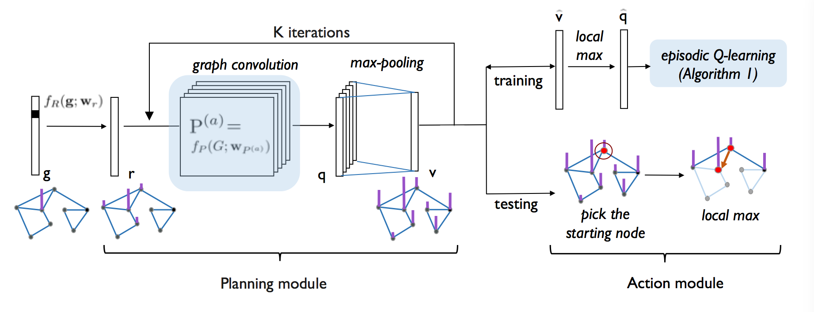

# [Generalized Value Iteration Networks: Life Beyond Lattices](https://arxiv.org/abs/1706.02416)
> Sufeng Niu, Siheng Chen, Hanyu Guo, Colin Targonski, Melissa C. Smith, Jelena Kovačević  _Generalized Value Iteration Networks_. 




## Dependencies
* Python >= 3.6
* TensorFlow >= 1.0
* SciPy >= 0.18.1 (to load the data)

## Training
Download the datasets from [here](https://drive.google.com/file/d/0B4eFbZCPIAvMSjRyZmNVR3dNbEU/view?usp=sharing)

```
# Runs 10 nodes graph with default parameter using imitation learning
python \irregular\IL\train.py

# Runs 10 nodes graph with default parameter using reinforcement learning
python \irregular\RL\train.py

# Runs 16x16 grid world with default parameter using imitation learning
python \regular\IL\train.py
```


## Acknowledgement:
This code is partially based on the TensorFlow implementation of Abhishek Kumar [here](https://github.com/TheAbhiKumar/tensorflow-value-iteration-networks/).


## Resources
* [Generalized Value Iteration Networks: Life Beyond Lattices on arXiv](https://arxiv.org/abs/1706.02416)
* [Value Iteration Networks on arXiv](https://arxiv.org/abs/1602.02867)
* [Value Iteration Networks in TensorFlow](https://github.com/TheAbhiKumar/tensorflow-value-iteration-networks)
